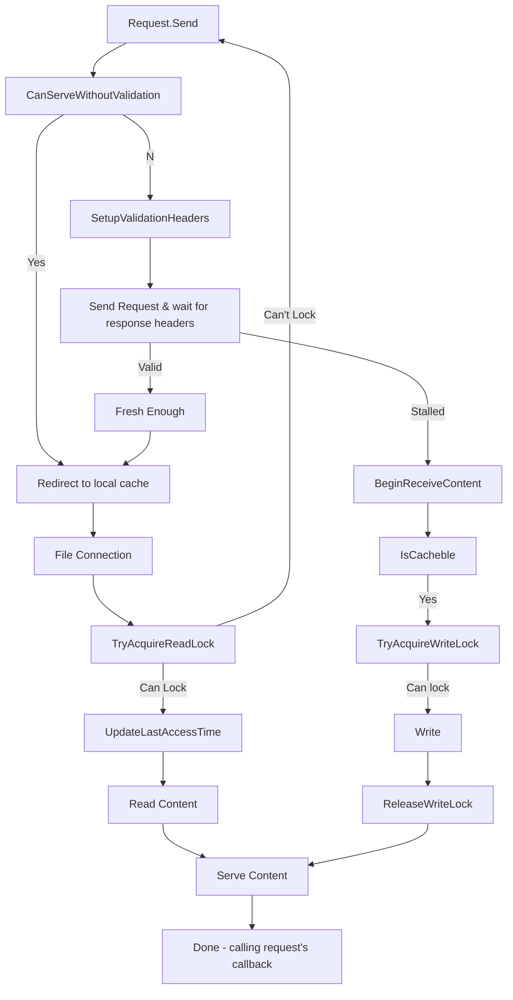

# Content Caching Internals

## Storage System

The HTTPCache stores and uses metadata in three layers:

1. **In-Memory Layer:** In the first layers it stores only the associated hash, stored response's length, its last access time, its lock state and number of readers. This first layer is loaded in memory for each entity speeding up the first round of decision making.
2. **Precision Layer:** The second layer contains more information about the caching values sent by the server (etag, max-age, etc.) and timing information to further increase age calculation precision.
3. **Content Layer:** The third and last layer stores the received response itself. The headers and the content are in different files, updating the headers on refresh checks and serving the content is easer if they are separated.

Every cached response gets a unique hash, which is calculated using the [HTTPCache.CalculateHash](../api-reference/Caching/HTTPCache.md#calculatehash) method based on the HTTP method and the uri of the resource.
This hash acts as a unique identifier for cached content and it's maps 1:1 with the cached files. 
`CalculateHash` is public, and can used with the combination of `HTTPCache`'s `GetHeaderPathFromHash` and `GetContentPathFromHash` it's possible to access the files directly.

!!! warning 
    While it's possible to access the files directly, it's not advised!
    The cache might update the content, reading from the files simultaneously can corrupt the data.
    Use the `BeginReadContent` - `EndReadContent` pair instead!

## Flowchart: Cache Lookup and Handling Mechanisms

The flowchart below illustrates the process from the moment a request is sent, to serving the content - whether from the cache or the server. 
It also depicts the system's resilience using fallback mechanisms, ensuring that even in the face of potential conflicts or cache evictions, 
the request doesn't end up in an error state but instead gets resent to fetch the resource from the server.

Caching incorporates numerous fallback mechanims, one of these can be seen in the flowchart too. If the content is determined as available at first, but when the FileConnection tries to acquire a read-lock, but fails (another request might refreshing it with a read-lock, or the content is evicted from the cache) instead of putting the request in an Errored state, it gets resent to download the resource from the server.

## Cache Maintenance

Maintaining cache size and ensuring it doesn't bloat beyond limits is a crucial aspect of the HTTPCache. 
The method `IsThereEnoughSpaceAfterMaintain` checks for sufficient space in the cache. 
If space is running low, the Maintain function gets called to free up space, if the content that the response currently writing to the cache, still can't fit the caching operation will be rolled back but the response's processing continues.

## Cache Control Mechanisms

The caching process is initiated with `BeginCache` and concluded with `EndCache`. These functions handle the caching of an HTTP response and take appropriate actions based on the status. 
These can be used directly to put content to the cache manually.
Users have the flexibility to manually control the caching process, with functionalities like [Delete](../api-reference/Caching/HTTPCache.md#delete) (to remove specific cache entries) and [Clear](../api-reference/Caching/HTTPCache.md#clear) (to remove all cache entries).

Furthermore, the CanServeWithoutValidation method ensures that the application can serve fresh content[^1] without having to validate it against the server, meaning that the content is available event while the device is offline.
This scenario however, requires that the server is sent the content with the right caching headers: `cache-control` with a `max-age` directive, or an `expires` header with a date in the future.

## Advanced Features

Additionally, the OnBeforeBeginCache event offers an additional layer of control to developers. 
It's called before caching starts, allowing developers to decide whether a specific content should be cached or not.

## Monitoring and Customization

The HTTPCache is equipped with events and options to provide insights and customization. 
The OnCacheSizeChanged event gets triggered when the cache size changes, giving a real-time understanding of cache utilization. 
The Options field, on the other hand, allows developers to tweak and define the cache behavior as per the application's requirements.

[^1]: Freshness is calculated based on the caching headers the server sent. A content can be freshed and can be fetched from the local cache without revalidating its freshness, fresh but revalidation is required or stalled.