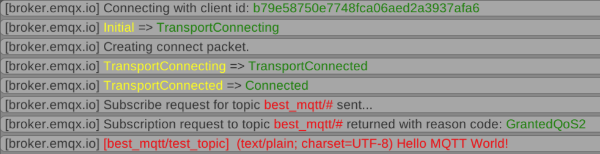

How to use an [ApplicationMessagePacketBuilder](../api-reference/Builders/ApplicationMessagePacketBuilder.md) to create and send an [Application Message](../api-reference/MQTT/ApplicationMessage.md) to the broker.

## Initial setup

Extending the code from the [previous chapter](index.md), we can add new event handler `OnConnected`:

```cs hl_lines="3 7"
client = new MQTTClientBuilder()
		// ...
		.WithEventHandler(OnConnected)
		// ...
		.CreateClient();

private void OnConnected(MQTTClient client)
{
}
```

The `OnConnected` event is fired when the client successfully connected with its transport, the MQTT protocol negotiation is over and messages can be sent. 
We will add code to this new callback to publish a new application message.

## Simple Publish

`MQTTClient` has a `CreateApplicationMessageBuilder` function to help in the creation and sending of application messages.

```cs
client.CreateApplicationMessageBuilder("best_mqtt/test_topic") /*(1)!*/
	.WithPayload("Hello MQTT World!") /*(2)!*/
	.BeginPublish(); /*(3)!*/
```

1. Create the builder with the given topic name.
1. Set the payload. `WithPayload` has an overload to accept a `#!cs byte[]` too to send binary data.
1. Start sending the application message.

Clients subscribing to the *best_mqtt/test_topic* topic produces the following output:



## Setting QoS Levels

Best MQTT supports both sending and receiving all three QoS levels on all supported platforms, including WebGL. 
We can define the application message's QoS level by using the `WithQoS` function:

```cs hl_lines="3"
client.CreateApplicationMessageBuilder("best_mqtt/test_topic")
	// ...
	.WithQoS(Best.MQTT.Packets.QoSLevels.ExactlyOnceDelivery) // send with QoS 2
	.BeginPublish();
```

| QoS | Description |
|-|-|
| AtMostOnceDelivery (QoS 0) | Sent only once by the client, no guarantee the server receives it. |
| AtLeastOnceDelivery (QoS 1) | Sent at least once, until receives an acknowledgement from the server that received it. QoS 1 messages might received more than once. |
| ExactlyOnceDelivery (QoS 2) | The protocol makes sure that QoS 2 messages are received only once. |

!!! Note "If `.WithQoS()` call is not present the plugin sends messages with `AtMostOnceDelivery` (QoS 0)."

!!! Warning "QoS setting of an application message controls **only** the QoS level between the client and the server. The server can deliver the message to its subscribing clients with different QoS levels."

## Content-Type

Using the `WithContentType` function we can specify what type of content we are sending. It's a textual description of the content. 
It's usually a MIME content type, but because neither the plugin or the server processing it, its meaning and usage is defined by the sending and receiving application.

```cs hl_lines="3"
client.CreateApplicationMessageBuilder("best_mqtt/test_topic")
        // ...
        .WithContentType("text/plain; charset=UTF-8")
        .BeginPublish();
```

## Setting Topic Alias

To send less data every time a message is published to a topic, a topic-alias can be assigned to the topic name. 
This way only the topic-alias number is sent instead of the full topic name possibly saving bandwith and processing time. 
To add a topic name mapping add the following line to the OnConnected handler before creating the application message builder:

```cs
client.AddTopicAlias("best_mqtt/test_topic");
```

When a topic alias added the next message published with the topic will inform the server about the mapping. Consecutive messages will use the mapping by omitting the topic name. 

!!! Tip "Best use of a topic name mapping is when messages are sent frequently to the topic and/or the topic name is long."

## Final code

```cs
using System;
using System.Collections;
using System.Collections.Generic;
using UnityEngine;

using Best.MQTT;
using Best.MQTT.Packets.Builders;

public class MQTT : MonoBehaviour
{
    MQTTClient client;

    // Start is called before the first frame update
    void Start()
    {
        client = new MQTTClientBuilder()
                        .WithOptions(new ConnectionOptionsBuilder().WithTCP("broker.emqx.io", 1883))
                        .WithEventHandler(OnConnected)
                        .WithEventHandler(OnDisconnected)
                        .WithEventHandler(OnStateChanged)
                        .WithEventHandler(OnError)
                      .CreateClient();

        client.BeginConnect(ConnectPacketBuilderCallback);
    }

    private void OnConnected(MQTTClient client)
    {
        client.AddTopicAlias("best_mqtt/test_topic");

        client.CreateApplicationMessageBuilder("best_mqtt/test_topic")
                .WithPayload("Hello MQTT World!")
                .WithQoS(Best.MQTT.Packets.QoSLevels.ExactlyOnceDelivery)
                .WithContentType("text/plain; charset=UTF-8")
                .BeginPublish();
    }

    private void OnDestroy()
    {
        client?.CreateDisconnectPacketBuilder()
            .WithReasonCode(DisconnectReasonCodes.NormalDisconnection)
            .WithReasonString("Bye")
            .BeginDisconnect();
    }

    private ConnectPacketBuilder ConnectPacketBuilderCallback(MQTTClient client, ConnectPacketBuilder builder)
    {
        return builder;
    }

    private void OnStateChanged(MQTTClient client, ClientStates oldState, ClientStates newState)
    {
        Debug.Log($"{oldState} => {newState}");
    }

    private void OnDisconnected(MQTTClient client, DisconnectReasonCodes code, string reason)
    {
        Debug.Log($"OnDisconnected - code: {code}, reason: '{reason}'");
    }

    private void OnError(MQTTClient client, string reason)
    {
        Debug.Log($"OnError reason: '{reason}'");
    }
}
```