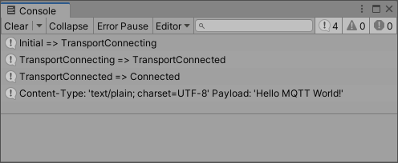
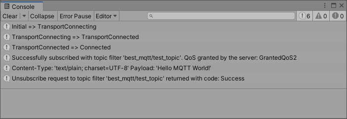

Learnt how to publish messages to a topic in the [previous article](publish.md), now it's time to learn how to subscribe to a topic and process application messages.

## Subscribe

Calling `CreateSubscriptionBuilder` a [topic filter](topic_filters.md) must be specified, all messages sent to a matching topic will be sent to the subscribing client. 
While the subscription would work without adding a message callback, usually we want to process application messages in a callback that we can add with `WithMessageCallback`:

```cs
client.CreateSubscriptionBuilder("best_mqtt/test_topic")
        .WithMessageCallback(OnMessage)
        .BeginSubscribe();
		
private void OnMessage(MQTTClient client, SubscriptionTopic topic, string topicName, ApplicationMessage message)
{
    // Convert the raw payload to a string
    var payload = Encoding.UTF8.GetString(message.Payload.Data, message.Payload.Offset, message.Payload.Count);

    Debug.Log($"Content-Type: '{message.ContentType}' Payload: '{payload}'");
}
```

In this example we subscribe to a concrete topic 'best_mqtt/test_topic' without using a wildcard. Any message sent to this concrete topic the server will forward to the subscribing client.

The `OnMessage` callback has the following parameters:

| Type | Name | Description |
|-|-|-|
| `MQTTClient` | `client` | The `MQTTClient` instance that we created the subscription with. |
| `SubscriptionTopic` | `topic` | A `SubscriptionTopic` instance that contains the original topic filter that the subscription subscribed to. |
| `string` | `topicName` | The topic name that matched with the topic filter. Because the topic filter can have wildecard `topicName` can be different from the topic filter the subscription created with. |
| `string` | `message` | The application message sent by the server. Among other fields, it has the `Payload` and `ContentType` fields we used in the previous article. |

!!! Warning "Do not keep a reference to the message's payload, it will be recycled after the event handler!"

Because MQTT packets (subscription, application messages, etc.) are sent and processed in order, the subscription request is received by the server first and right after the application message too. 
The application message's topic matches with the subscription's topic filter so the server will send back the application message to our client.

```cs
private void OnConnected(MQTTClient client)
{
    client.CreateSubscriptionBuilder("best_mqtt/test_topic")
            .WithMessageCallback(OnMessage)
            .BeginSubscribe();

    client.CreateApplicationMessageBuilder("best_mqtt/test_topic")
            .WithPayload("Hello MQTT World!")
            .WithQoS(Best.MQTT.Packets.QoSLevels.ExactlyOnceDelivery)
            .WithContentType("text/plain; charset=UTF-8")
            .BeginPublish();
}
```



## Define Maximum QoS

Each subscription can define its supported [QoS level](../intermediate-topics/qos.md) that the server can deliver application messages with. 
This is the maximum level the client wants to support for that subscription, but the server can choose a lower maximum too.

```cs hl_lines="3"
client.CreateSubscriptionBuilder("best_mqtt/test_topic")
        // ...
        .WithMaximumQoS(QoSLevels.ExactlyOnceDelivery)
        .BeginSubscribe();
```

!!! Note "If there's no `.WithMaximumQoS` call, the plugin uses the server's maximum supported QoS level."

## Acknowledgement callback

In some cases we might want to know when and how successfully the subscribe operation gone. 
For example whether the subscription succeeded or not, or what QoS level is granted by the server. 
For these cases we can add an acknowledgement callback:

```cs hl_lines="3"
client.CreateSubscriptionBuilder("best_mqtt/test_topic")
		// ...
        .WithAcknowledgementCallback(OnSubscriptionAcknowledged)
        .BeginSubscribe();
		
private void OnSubscriptionAcknowledged(MQTTClient client, SubscriptionTopic topic, SubscribeAckReasonCodes reasonCode)
{
    if (reasonCode <= SubscribeAckReasonCodes.GrantedQoS2)
        Debug.Log($"Successfully subscribed with topic filter '{topic.Filter.OriginalFilter}'. QoS granted by the server: {reasonCode}");
    else
        Debug.Log($"Could not subscribe with topic filter '{topic.Filter.OriginalFilter}'! Error code: {reasonCode}");
}
```

`reasonCode` is a success/error code. If it's less than or equal to `SubscribeAckReasonCodes.GrantedQoS2` the client successfully subscribed with the given topic filter. 
Otherwise `reasonCode` is an error code describing why the subscription attempt failed.

## Bulk subscribe

It's possible to subscribe to multiple topics in one go. Using `MQTTClient`'s `CreateBulkSubscriptionBuilder`, `WithTopic` can be used multiple times and the client will send the subscribe request in one packet. 
`SubscribeTopicBuilder` has the same options to set as the builder returned with `CreateSubscriptionBuilder`.

```cs
client.CreateBulkSubscriptionBuilder()
    .WithTopic(new SubscribeTopicBuilder("best_mqtt/topic_1")
                        .WithMessageCallback(OnTopic1Message))
    .WithTopic(new SubscribeTopicBuilder("best_mqtt/topic_2")
                        .WithMessageCallback(OnTopic2Message))
    .BeginSubscribe();
```

## Unsubscribe

To unsubscribe from a topic filter the `CreateUnsubscribePacketBuilder`/`CreateBulkUnsubscribePacketBuilder` functions can be used, similarly as theirs subscription counterparts:
```cs
client.CreateUnsubscribePacketBuilder("best_mqtt/test_topic")
    .WithAcknowledgementCallback((client, topicFilter, reasonCode) => Debug.Log($"Unsubscribe request to topic filter '{topicFilter}' returned with code: {reasonCode}"))
    .BeginUnsubscribe();
```

Adding the above code to the `OnMessage` callback to unsubscribe from the topic after a message is received produces the following output:



## Final code

```cs
using System;
using System.Text;
using System.Collections;
using System.Collections.Generic;

using UnityEngine;

using Best.MQTT;
using Best.MQTT.Packets.Builders;
using Best.MQTT.Packets;

public class MQTT : MonoBehaviour
{
    MQTTClient client;

    // Start is called before the first frame update
    void Start()
    {
        client = new MQTTClientBuilder()
#if !UNITY_WEBGL || UNITY_EDITOR
                        .WithOptions(new ConnectionOptionsBuilder().WithTCP("broker.emqx.io", 1883))
#else
                        .WithOptions(new ConnectionOptionsBuilder().WithWebSocket("broker.emqx.io", 8084).WithTLS())
#endif
                        .WithEventHandler(OnConnected)
                        .WithEventHandler(OnDisconnected)
                        .WithEventHandler(OnStateChanged)
                        .WithEventHandler(OnError)
                      .CreateClient();

        client.BeginConnect(ConnectPacketBuilderCallback);
    }

    private void OnConnected(MQTTClient client)
    {
        client.AddTopicAlias("best_mqtt/test_topic");

        client.CreateSubscriptionBuilder("best_mqtt/test_topic")
                .WithMessageCallback(OnMessage)
                .WithAcknowledgementCallback(OnSubscriptionAcknowledged)
                .WithMaximumQoS(QoSLevels.ExactlyOnceDelivery)
                .BeginSubscribe();

        client.CreateApplicationMessageBuilder("best_mqtt/test_topic")
                .WithPayload("Hello MQTT World!")
                .WithQoS(QoSLevels.ExactlyOnceDelivery)
                .WithContentType("text/plain; charset=UTF-8")
                .BeginPublish();
    }

    private void OnMessage(MQTTClient client, SubscriptionTopic topic, string topicName, ApplicationMessage message)
    {
        // Convert the raw payload to a string
        var payload = Encoding.UTF8.GetString(message.Payload.Data, message.Payload.Offset, message.Payload.Count);

        Debug.Log($"Content-Type: '{message.ContentType}' Payload: '{payload}'");

        client.CreateUnsubscribePacketBuilder("best_mqtt/test_topic")
            .WithAcknowledgementCallback((client, topicFilter, reasonCode) => Debug.Log($"Unsubscribe request to topic filter '{topicFilter}' returned with code: {reasonCode}"))
            .BeginUnsubscribe();
    }

    private void OnSubscriptionAcknowledged(MQTTClient client, SubscriptionTopic topic, SubscribeAckReasonCodes reasonCode)
    {
        if (reasonCode <= SubscribeAckReasonCodes.GrantedQoS2)
            Debug.Log($"Successfully subscribed with topic filter '{topic.Filter.OriginalFilter}'. QoS granted by the server: {reasonCode}");
        else
            Debug.Log($"Could not subscribe with topic filter '{topic.Filter.OriginalFilter}'! Error code: {reasonCode}");
    }

    private void OnDestroy()
    {
        client?.CreateDisconnectPacketBuilder()
            .WithReasonCode(DisconnectReasonCodes.NormalDisconnection)
            .WithReasonString("Bye")
            .BeginDisconnect();
    }

    private ConnectPacketBuilder ConnectPacketBuilderCallback(MQTTClient client, ConnectPacketBuilder builder)
    {
        return builder;
    }

    private void OnStateChanged(MQTTClient client, ClientStates oldState, ClientStates newState)
    {
        Debug.Log($"{oldState} => {newState}");
    }

    private void OnDisconnected(MQTTClient client, DisconnectReasonCodes code, string reason)
    {
        Debug.Log($"OnDisconnected - code: {code}, reason: '{reason}'");
    }

    private void OnError(MQTTClient client, string reason)
    {
        Debug.Log($"OnError reason: '{reason}'");
    }
}

```