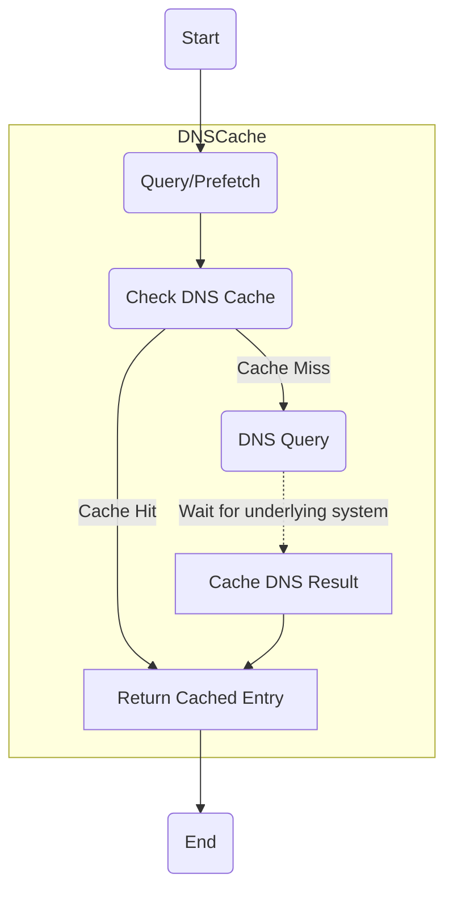

# DNS Cache in Best HTTP

To optimize and improve the speed of DNS resolutions, Best HTTP implements a DNS cache system with a similiar algorithm to the `Happy Eyeballs Version 2: Better Connectivity Using Concurrency` [described in RFC 8305](https://www.rfc-editor.org/rfc/rfc8305).
This system temporarily stores DNS query results, reducing the need for repeated resolutions and enhancing network efficiency.
It's now possible to prefetch and cache DNS queries on startup, long before the first user interaction to reduce the first request-response roundtrip faster.

## Key Features
The `DNSCache` class in the Best HTTP offers:

- **Efficiency Improvements:** By caching DNS query results, redundant resolutions are minimized, speeding up network communication.
- **DNS Prefetching:** Resolves and caches DNS records in advance, reducing future network request latency.
- **Non-Working IP Address Reporting:** Allows marking specific IP addresses as non-functional, helping the cache make better decisions for future connections.
- **Cache Reset:** Facilitates the removal of all stored DNS resolutions, giving an option for a fresh start.
- **Custom DNS Queries:** Directly resolves DNS records for specified hostnames and caches the results.
- **Cache Behavior Configuration:** Uses the DNSCacheOptions class to set cache behavior parameters, including refresh intervals and cancellation check granularity.
- **Benefit for Protocols/Packages:** All protocols and packages built on top of Best HTTP automatically benefit from this DNS cache system, ensuring consistently fast connections across the board.

## Deeper-Dive

Here's a high-level view about the algorithm:



The DNS Cache further maintains cached entries by:

1. refreshing them periodically in the background to try to keep them fresh and
1. after a timeout, deleting unused ones to free up resources.

The DNS Cache is part of a wider improvement over the old algorithm, for more insight visit the [Connections/Racing](../connections/racing.md) topic.

## How to Use the DNSCache Class

!!! note "All protocols and packages built on top of Best HTTP automatically utilize the `DNSCache`, eliminating the need for any additional setup or calls!"

Here's a brief guide on how to use the `DNSCache` class:

```cs title="Prefetch DNS Records"
DNSCache.Prefetch("www.example.com");
```

```cs title="Report Non-Working IP Addresses"
IPAddress nonWorkingAddress = IPAddress.Parse("123.456.78.9");
DNSCache.ReportAsNonWorking("www.example.com", nonWorkingAddress, null);
```

```cs title="Clear the DNS Cache"
DNSCache.Clear();
```

```cs title="Initiate a DNS Query"
Uri address = new Uri("http://www.example.com");
DNSQueryParameters parameters = new DNSQueryParameters(address);
parameters.Callback = (@param, result) => Debug.Log($"Number of IP addresses found for hostname('{result.HostName}'): {result.Addresses?.Length}");

DNSCache.Query(parameters);
```

By leveraging the features of the `DNSCache` class, developers can ensure efficient DNS resolutions, thus improving network performance in their applications.

## Conclusion

While DNS is just one part of the entire web connection process, it plays a pivotal role. 
A well-optimized DNS system can significantly boost connection speeds, reduce latency, and provide a smoother internet browsing experience. 
However, it's also important to note that while DNS can help in speeding up the initial connection, the overall speed of data transfer will also depend on other factors like bandwidth, server health, and network conditions.