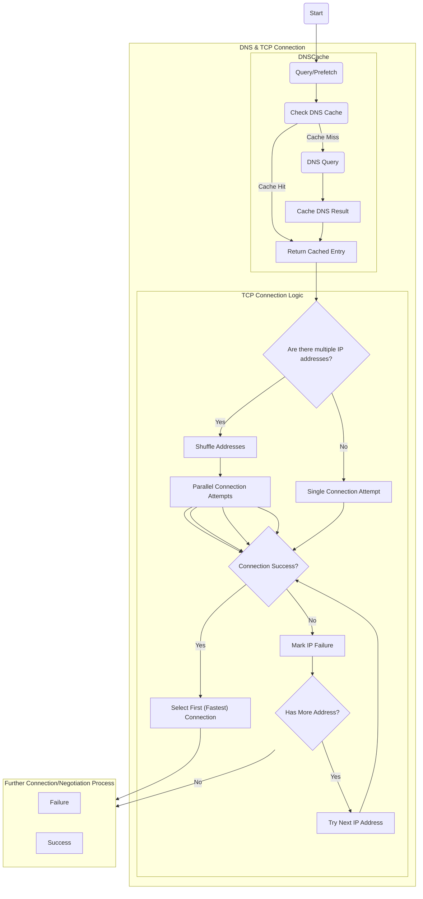

# Connection Improvements

As describen in the [DNS topic](../DNS/dns-cache.md), it's now possible to prefetch and cache DNS queries on startup, long before the first user interaction; to reduce the first request-response roundtrip faster.

But there's a new tcp connection logic too, that comes after the DNS query.
The old one went over the IP addresses the DNS query returned with one-by-one. If the first one was slow to connect and took up the whole time the request allowed, then it got timed out, failing the whole request, evven thought there would be a working and fast tcp connection to another IP address.

To resolve this issue, and even improve on the connection speed in v3, if there are multiple addresses it will try to connect to a maximum of 4 (by default, it's configurable) at once and pick the fastest connecting one!
Those addresses that fail to connect are marked as such, and if there's a need for a new connection, those IP addresses will be tried last.

Another new feature is that custom IP address shuffling algorithms can be added and implemented.

!!! Note "These improvements are used automatically and improve the connection speed of all protocols that are using Best HTTP. So, for example both Best Socket.IO and Best SignalR, after the initial negotiation request will try to connect with their WebSocket transport, but now WebSocket does NOT have to wait for a DNS query because the IP addresses are already cached!"

## High-Level Flow

Here's a high-level view about the algorithm:


## Code Examples

```cs title="Disable Shuffling of Addresses For One Host"
Best.HTTP.Shared.HTTPManager.PerHostSettings.Get("example.com")
                .TCPRingmasterSettings.ShuffleAddresses = false;
```

```cs title="Disable Shuffling of Addresses For Every Host"
Best.HTTP.Shared.HTTPManager.PerHostSettings.Get("*")
                .TCPRingmasterSettings.ShuffleAddresses = false;
```

More about how to use `PerHostSettings` can be found under the [Per-Host Settings](per-host-settings.md) topic.

```cs title="Implement Custom Shufffling Algorithm for Only One Host"
Best.HTTP.Shared.HTTPManager.PerHostSettings.Get("example.com")
                .TCPRingmasterSettings.CustomAddressShuffleAlgorithm 
                    = (@params) =>
                    {
                        var rand = new System.Random();
                        int n = @params.Addresses.Length;
                        while (n > 1)
                        {
                            int k = rand.Next(n--);
                            (@params.Addresses[n], @params.Addresses[k]) = (@params.Addresses[k], @params.Addresses[n]);
                        }
                    };
```

```cs title="Revert Back To The Old Behavior For a Specific Host"
var settings = Best.HTTP.Shared.HTTPManager.PerHostSettings.Get("example.com");
            settings.TCPRingmasterSettings.MaxSimultaneousRacers = 1;
            settings.TCPRingmasterSettings.ShuffleAddresses = false;
```