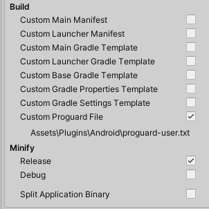

# Proxy Autodetect

The ProxyDetector class coordinates automatic proxy detection in the Best HTTP package. This feature supports different modes of operation and can be customized with various detectors.

## Enabling and Configuring Proxy Detection

Automatic proxy detection is on by default. 

If you want to change the defaults, or add/remove detectors, instantiate a ProxyDetector and assign it to the `HTTPManager.ProxyDetector`. For example:

```cs title="Create and set a new Proxy Detector with default settings"
Best.HTTP.Shared.HTTPManager.ProxyDetector = new Best.HTTP.Proxies.Autodetect.ProxyDetector(Best.HTTP.Proxies.Autodetect.ProxyDetectionMode.CacheFirstFound);
```

## Proxy Detection Modes
The ProxyDetector can operate in two modes:

- **ProxyDetectionMode.Continouos**: The detector checks for a proxy for every request.
- **ProxyDetectionMode.CacheFirstFound**: The detector caches and reuses the first proxy it could find.
 
By default, `ProxyDetectionMode.CacheFirstFound` is used. You can specify the mode in the constructor:

```cs title="Set Proxy Detection Mode"
HTTPManager.ProxyDetector = new ProxyDetector(ProxyDetectionMode.Continouos);
```

## Disabling Proxy Detection

To disable automatic proxy detection:

```cs title="Disable by null"
HTTPManager.ProxyDetector = null;
```

Alternatively, call `Detach()` on the `ProxyDetector`:

```cs title="Disable by Detach"
HTTPManager.ProxyDetector.Detach();
```

## Restarting Proxy Detection

To restart a previously detached detector, call `Reattach()` or assign a new `ProxyDetector`:

```cs title="Reattach"
HTTPManager.ProxyDetector.Reattach();
```

```cs title="Create New"
HTTPManager.ProxyDetector = new ProxyDetector();
```

## Proxy Detectors
The ProxyDetector uses implementations of the `IProxyDetector` interface. By default, these include:

- **ProgrammaticallyAddedProxyDetector:** Returns the `HTTPManager.Proxy`. By default it has the highest priority to keep and use the manually set proxy.
- **EnvironmentProxyDetector:** Checks environment variables like `HTTP_PROXY`, `HTTPS_PROXY`, and `NO_PROXY`.
- **FrameworkProxyDetector:** Utilizes .NET's `System.Net.WebRequest.GetSystemWebProxy()`.
- **AndroidProxyDetector:** For Android systems, using Java's [ProxySelector](https://developer.android.com/reference/java/net/ProxySelector).

!!! Notice "The `AndroidProxyDetector` requires the built-in [Android JNI](https://docs.unity3d.com/Manual/com.unity.modules.androidjni.html) module. Enable it through the [Package Manager window](https://docs.unity3d.com/Manual/upm-ui.html)."

## Limitations

Not all platforms are supported. Under WebGL, proxies are detected/managed by the browser. 
The `HTTPManager.Proxy`, `HTTPManager.ProxyDetector`, and `HTTPRequest`'s Proxy are not compiled into builds for WebGL to reduce build size.
Proxy detection might not work under MacOS and iOS.

### Issues With Minify

When [Minify](https://docs.unity3d.com/Manual/android-optimize-distribution-size.html) is enabled, it will detect that the `com.Best.HTTP.proxy.ProxyFinder` class isn't used and removes it completely.
Errors will surface during runtime, producing errors like this:
> 11-13 09:27:49.397 27205 27520 E Unity   : {"tid":1,"div":"AndroidProxyDetector","msg":"GetProxy","ex": [{"msg": "**java.lang.ClassNotFoundException: com.Best.HTTP.proxy.ProxyFinder**", "stack": "..."}]

These errors are harmless in that `HTTPRequest`s will be processed, but if there's a proxy set for the device, it will not be able to detect and use.

The solution to the issue is to add a `Custom Proguard File`:

  

And add the following content, to keep all classes from the `com.Best.HTTP.proxy` package (including the only class in the package, `ProxyFinder`):

```txt title="proguard-user.txt"
-keep class com.Best.HTTP.proxy.* { *; }
```

!!! Tip "As can be seen in the picture above, when ticking the `Custom Proguard File` option in the Unity Editor, it creates an empty `proguard-user.txt` file under the `\Assets\Plugins\Android\` folder."

More about Proguard configuration can be found in the [Proguard Manual](https://www.guardsquare.com/manual/home).