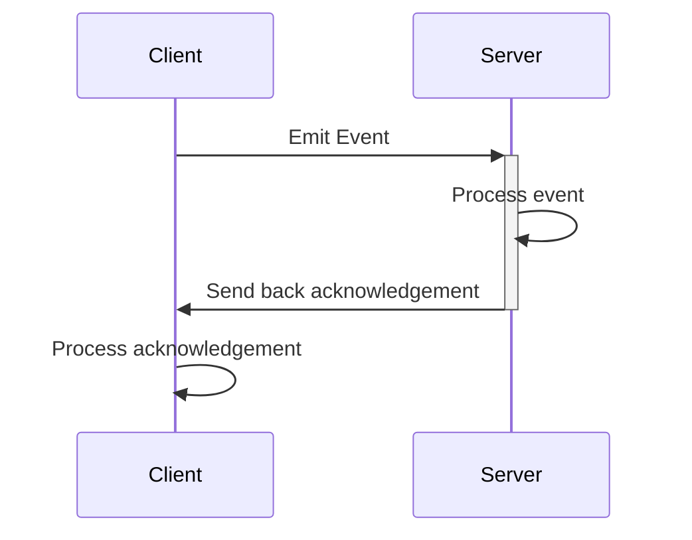
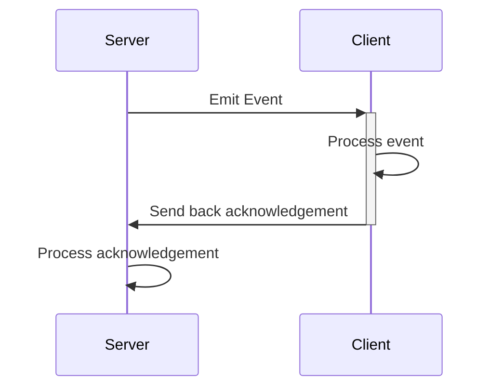

# Subscribing to events

Subscribing to Socket.IO events can be done through the `On` and `Once` functions. 
There's also an `ExpectAcknowledgement` function that can be used to add a callback that will be called when [the server executes a callback function](https://socket.io/docs/v4/emitting-events/#acknowledgements).

## Default events

The Socket.IO protocol defines a few default events whose are independent from user-defined and emitted ones, and we can subscribe to to get notified about the protocol's lifecycle events.
Most of these events are parameter-less, exceptions are the `connect` and `error` events:

!!! Example
    ```cs
    using Best.SocketIO;

    var manager = new SocketManager(new Uri("http://localhost:3000"));

    manager.Socket.On<ConnectResponse>(SocketIOEventTypes.Connect, OnConnected);
    manager.Socket.On<Error>(SocketIOEventTypes.Error, OnError);

    void OnConnected(ConnectResponse resp)
    {
      Debug.Log("Connected!");
    }

    void OnError(Error error)
    {
      Debug.Log($"An error occured: {error}");
    }
    ```

Parameter-less default events for example are `connecting`, `disconnect`, `reconnecting` and `reconnect`.
!!! Tip "A flow-chart about the emitted default events and life-cycle of a Socket.IO connection can be found in the [Intermediate Topics/Emitted Events](../intermediate-topics/events-flow.md) topic."

## Parameterless events

These events don't expect any additional parameter sent as a parameter from the servers:

!!! Example
    ```cs title="Client"
    manager.Socket.On("no_param", OnMethod);

    void OnMethod()
    {
        Debug.Log("OnMethod!")
    }
    ```

    ```js title="Server"
    io.on("connection", (socket) => {
      socket.emit('no_param', 'draw a card');
    });
    ```

## Strongly typed events

Both `On` and `Once` can accept type parameters (up to five) and the parser will try to parse the received event to match these types. 
For example the following call on the server:
!!! Example
    ```js title="Server"
    io.on("connection", (socket) => {
      socket.emit('message', 0, 1);
    });
    ```

    To subscribe to this event called `"message"`, with two `int` parameters; we can write the following code on the client:
    ```cs title="Client"
    manager.Socket.On<int, int>("message", (arg1, arg2) => Debug.Log($"{arg1}, {arg2}"));
    ```

Complex objects can be sent and subscribed to, too:

!!! Example
    ```js title="Server"
    io.on("connection", (socket) => {
      socket.emit("user-info", {
          users: ["User 1", "User 2"],
          buff: Buffer.from([9, 8, 7, 6, 5, 4, 3, 2, 1])
      });
    });
    ```

    ```cs title="Client"
    class UserInfo
    {
        public string[] users;
        public byte[] buff;
    }

    manager.Socket.On<UserInfo>("user-info", OnUserInfo);

    private void OnUserInfo(UserInfo userInfo)
    {
        Debug.Log($"user-info: {string.Join(",", userInfo.users)}, buff: {userInfo.buff.Length}");
    }
    ```

!!! Warning
    If a type is used only in subscriptions, [Managed Code Stripping](https://docs.unity3d.com/Manual/ManagedCodeStripping.html) can remove its default constructor causing errors in builds.
    To prevent these kind of errors, types can be annotated with the [Preserve attribute](https://docs.unity3d.com/Manual/ManagedCodeStripping.html#PreserveAttribute).

    Using the previous example, we can annotate the `UserInfo` class to support even the highest stripping level:
    ```cs title="Client" hl_lines="1"
    [UnityEngine.Scripting.Preserve]
    class UserInfo
    {
        public string[] users;
        public byte[] buff;
    }

    manager.Socket.On<UserInfo>("user-info", OnUserInfo);

    private void OnUserInfo(UserInfo userInfo)
    {
        Debug.Log($"user-info: {string.Join(",", userInfo.users)}, buff: {userInfo.buff.Length}");
    }
    ```

    In this case `users` and `buff` doesn't need to be annotated, because the Unity linker will know that they are used in the `OnUserInfo` so it will not consider it to remove them.

!!! Note "By default, any additional fields present in the receiving type that have no corresponding field in the JSON will be initialized to their default value."

Binary data can be sent too:

!!! Example
    ```js title="Server"
    io.on("connection", (socket) => {
      socket.emit('binary', Buffer.from([9, 8, 7, 6, 5, 4, 3, 2, 1]));
    });
    ```

    ```cs title="Client"
    manager.Socket.On<byte[]>("binary", OnBinaryMessage);

    private void OnBinaryMessage(byte[] buffer)
    {
        Debug.Log("OnBinaryMessage: " + buffer.Length);
    }
    ```

## Injecting SocketManager and Socket as callback parameters

The default parser implementations of the Best Socket.IO package can inject `Socket` and `SocketManager` instances to the callback's parameters.
So, it's possible to define a callback to receive the receiving namespace (eg. Socket) and/or SocketManager instance as a parameter:

!!! Example
    ```js title="Server"
    io.on("connection", (socket) => {
      socket.emit('no_param', 'draw a card');
    });
    ```

    The server doesn't (and can't) send the socket, but the parser knows about the subscriptions' type parameters and inject well-known types' instances:

    ```cs title="Client"
    manager.Socket.On<Socket>("no_param", OnMethod);

    void OnMethod(Socket socket)
    {
        Debug.Log($"OnMethod! Socket ID: {socket.Id}")
    }
    ```

!!! Note "This only works with events sent by the server and not with locally generated events like `disconnect`!"

## Server Acknowledgements

With the help of `ExpectAcknowledgement` function, we can define a callback that will be called after the server received and processed the original event.
The acknowledgement can have its own, strongly typed parameters too.



!!! Example
    ```cs title="Client"
    class AcknowledgementReturnVal
    {
        public string status;
    }

    manager.Socket.ExpectAcknowledgement<AcknowledgementReturnVal>(OnAcknowledgements)
        .Emit("update item", 1, new { name: "updated" });

    private void OnAcknowledgements(AcknowledgementReturnVal value)
    {
        Debug.Log(value.status); // "ok"
    }
    ```

    ```js title="Server"
    io.on("connection", (socket) => {
      socket.on('update item', (arg1, arg2, ack_callback) => {
          // process event
          console.log(arg1); // 1
          console.log(arg2.name); // "updated"

          // send back acknowledgement:
          ack_callback({ status: "ok" });
      });
    });
    ```

You can find Socket.IO's documentation about acknowledgements here: [emitting-events/acknowledgements](https://socket.io/docs/v4/emitting-events/#acknowledgements)

## Server Acknowledgement Timeouts

With the help of the `Timeout` function a hard limit can be defined for acknowledgements to arrive. When a timeout is added only one callback will be called, either the timeout's or the acknowledgement's one.

!!! Example
	```cs title="Client" hl_lines="7"
    class AcknowledgementReturnVal
    {
        public string status;
    }

    manager.Socket
		.Timeout(TimeSpan.FromSeconds(1), (socket) => Debug.Log("Ack TimeOut!"))
		.ExpectAcknowledgement<AcknowledgementReturnVal>(OnAcknowledgements)
        .Emit("update item", 1, new { name: "updated" });

    private void OnAcknowledgements(AcknowledgementReturnVal value)
    {
        Debug.Log(value.status); // "ok"
    }
    ```

    ```js title="Server"
    io.on("connection", (socket) => {
      socket.on('update item', (arg1, arg2, ack_callback) => {
          // process event
          console.log(arg1); // 1
          console.log(arg2.name); // "updated"

          // send back acknowledgement:
          ack_callback({ status: "ok" });
      });
    });
    ```

The `Timeout` function expect a `TimeSpan` and an optional callback that's called in case of timing out.

## Client Acknowledgements

Client acknowledgements are similar to the server acks, but the other way around: the client can trigger an acknowledgement callback on the server:



The client can use the `Socket`'s `EmitAck` in a server-callable function to send back an acknowledgement.

!!! Example
    ```js title="Server"
    io.on("connection", (socket) => {
      var ack_callback = (p1, p2, p3) => {
          console.log(`callback: ${p1}, ${p2}, ${p3}`); // 1, 2, 3
      };

      socket.emit('wait_for_ack', 1, 2, 3, ack_callback);
    });
    ```

    Here we defined `ack_callback` as a function with three parameters (p1, p2 and p3), and its implementation logs out those parameters.

    ```cs title="Client"
    manager.Socket.On<Socket, int, int, int>("wait_for_ack", OnWaitForAck);

    private void OnWaitForAck(Socket socket, int arg1, int arg2, int arg3)
    {
        Debug.Log($"wait_for_ack: {arg1}, {arg2}, {arg3}"); // 1, 2, 3

        socket.EmitAck(arg3, arg2, arg1); // 3, 2, 1
    }
    ```

    On the client, we used `EmitAck` to trigger the callback method on the server; and send back the three parameters it received originally.
