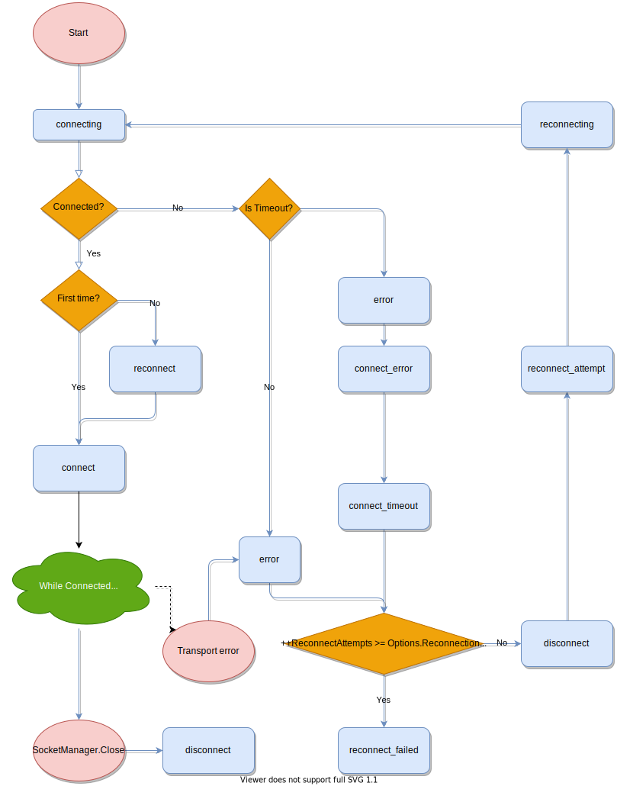

# Emitted events

This flow-chart represents a SocketManager's lifecycle and locally generated events (light blue colored rounded rectangles).

 
 
As described both in the [Default events](../getting-started/index.md#default-events) and [Special Events](index.md#special-events) sections, `connect` and `error` are special events witch means they have concrete parameters.
Other emitted events have no parameters (other than the possibility of injecting `SocketManager` and `Socket` instances):

!!! Example
    ```csharp
    manager.Socket.On("connecting", () => Debug.Log("connecting"));
    manager.Socket.On("reconnect", () => Debug.Log("reconnect"));
    manager.Socket.On("reconnecting", () => Debug.Log("reconnecting"));
    // ...
    ```