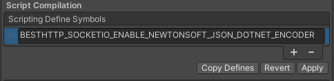

# Parsers

## MessagePack Parser

By default the SocketManager uses a JSon parser and LitJson to encode/decode objects. It's also capable to send and receive MsgPack encoded messages if the server uses [socket.io-msgpack-parser](https://github.com/darrachequesne/socket.io-msgpack-parser).

To enable and use it, follow these steps:

1. Download and import the [Json & MessagePack Serialization](https://assetstore.unity.com/packages/tools/network/json-messagepack-serialization-59918?aid=1101lfX8E) package
2. Create a new [Asembly Definition file](https://docs.unity3d.com/Manual/ScriptCompilationAssemblyDefinitionFiles.html) under the *Plugins\GameDevWare.Serialization* folder
3. Locate the BestHTTP.asmdef file under the *Best HTTP* folder
4. Reference the newly create asmdef file and press Apply:

	
	
5. Add the **BESTHTTP_SOCKETIO_ENABLE_GAMEDEVWARE_MESSAGEPACK** define to the [Scripting Define Symbols](https://docs.unity3d.com/Manual/PlatformDependentCompilation.html) input under **PlayerSettings/Other Settings**:

	
	
6. Use the now available `MsgPackParser` class:
```csharp
var manager = new SocketManager(new Uri("http://localhost:3000"));
manager.Parser = new MsgPackParser();
```

The `MsgPackParser` class can be found in the `Best HTTP\Examples\Socket.IO3\Parsers\` folder.

## JSON.NET
Another JSon parser using [Newtonsoft's JSON .NET For Unity](https://assetstore.unity.com/packages/tools/input-management/json-net-for-unity-11347?aid=1101lfX8E). 

Steps to enable it and use it:

1. Download and import the [Newtonsoft's JSON .NET For Unity](https://assetstore.unity.com/packages/tools/input-management/json-net-for-unity-11347?aid=1101lfX8E) package.
2. Add the **BESTHTTP_SOCKETIO_ENABLE_NEWTONSOFT_JSON_DOTNET_ENCODER** define to the [Scripting Define Symbols](https://docs.unity3d.com/Manual/PlatformDependentCompilation.html) input under **PlayerSettings/Other Settings** and press **Apply**:

	
	
3. Use the now-available `JsonDotNetEncoder` class:
```csharp
var manager = new SocketManager(new Uri("https://localhost:3000/"), new JsonDotNetParser());
```

`JsonDotNetParser` class can be found in the `\Best HTTP\Examples\SocketIO3\Parsers\` folder.
