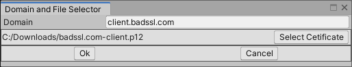

# Client Certificates

A client certificate can be associated with a domain. If the server asks for a client certificate during the TLS handshake, the client going to send it back.

{ loading=lazy }

1. **Add for domain:** Clicking on it a `Domain and File Selector` window is shown. If the domain is filled and the certification file is selected clicking on the *Ok* button going to add the certification for the domain.
2. **Delete Selected:** Delete selected domain-certificate associations.
3. **Help (?) Button:** Opens a browser window to this manual.
4. **# Column:** Index of the certificate
5. **Target Domain Column:** The certificate sent only if it's requested for the target domain.
6. **Authority Column:** *Common Name* or *Organizational Unit Name* from the certificate's Issuer field.
7. **Certifications:** Number of certifications displayed.
8. **Certificate Size Stats:** Min, max, sum and average size of certificate data in bytes. This can help adjusting cache sizes.

Clicking on the `Add for domain` button a new window opens to select the certification file and domain:

{ loading=lazy }

Then, clicking on the *Ok* button depending on the type of certificate file a window to input the file's password might open:

{ loading=lazy }
