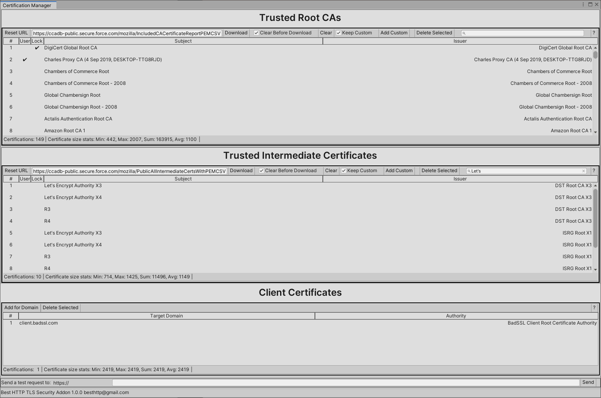

## Certification Manager Window

The *Window/Best TLS Security/Certification Window* menu item (or CTRL+ALT+E shortcut) opens the addon's Certification Manager. Using this window certificates can be added, updated and deleted.

{ loading=lazy }

1. **Trusted Root CAs:** Top-most, root certificates. Each root CA has a "root certificate" that is self-signed and serves as the starting point for trust. When you visit a website with HTTPS, for example, your browser checks the website's SSL/TLS certificate against the list of trusted root CAs. If the certificate is signed directly by a trusted root CA or by an intermediate CA that chains back to a trusted root, the browser will establish a secure connection without warnings.
2. **Trusted Intermediate Certificates:** They act as a link between the trusted root certificate authorities (CAs) and the end-entity certificates issued to domains. While root CAs are at the top of the certificate chain, intermediate certificates are necessary to create a chain of trust from the end-entity certificate back to the trusted root CA.
3. **Client Certificates:** Optional certificates that can be assigned to host names to send to the server during the TLS negotiation phase.
4. **Testing Http Requests:** With the help of this section, a HTTP request can be sent immediately to test certifications.

## Testing HTTP Requests

A basic GET request can be sent out for the given domain to test the current setup.

{ loading=lazy }
	
1. Input field for the domain to test
2. Send button
3. Result of the request

!!! Warning "Because of [Connection Pooling](../../../Shared/connections/pooling.md) a request that otherwise would fail can succeed if there's an already open connection to the domain!"

## Bottom Toolbar

{ loading=lazy }

1. Name and version number of this addon
