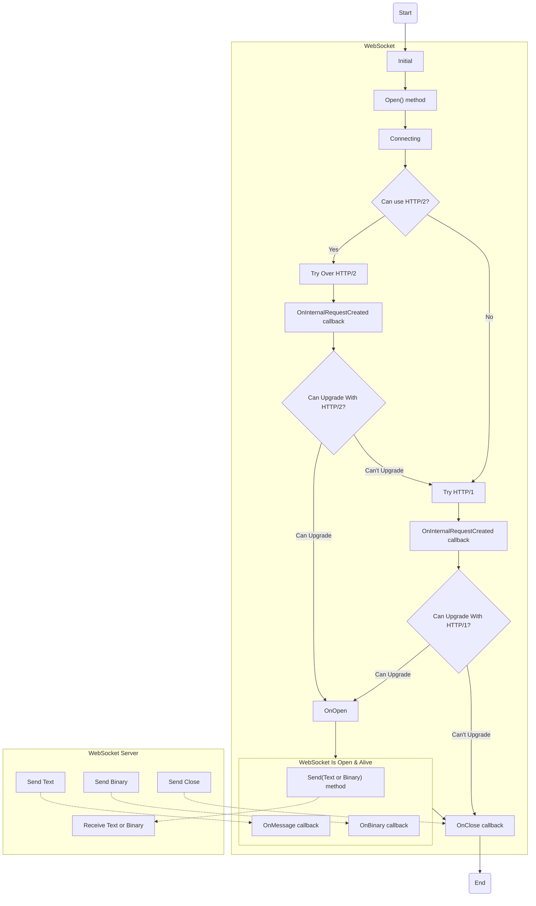

# Lifecycle

A high-level overview about the flow of the events and lifecycle of a WebSocket connection:

```mermaid
graph TD
    Start(Start) --> Initial

    subgraph WebSocket
        Initial --> Open
        Open["Open() method"] --> Connecting
        Connecting --> WsOH2{Can use HTTP/2?}
        WsOH2 -->|Yes| TryWsOH2[Try Over HTTP/2]
        WsOH2 -->|No| TryHTTP1
        TryWsOH2 --> HTTP2Req[OnInternalRequestCreated callback]
        HTTP2Req --> TryUpgradeHTTP2{"Can Upgrade With HTTP/2?"}
        TryUpgradeHTTP2 -->|Can Upgrade| OnOpen
        TryUpgradeHTTP2 -->|Can't Upgrade| TryHTTP1[Try HTTP/1]
        TryHTTP1 --> HTTP1Req[OnInternalRequestCreated callback]
        HTTP1Req --> TryUpgradeHTTP1{"Can Upgrade With HTTP/1?"}
        TryUpgradeHTTP1 -->|Can Upgrade| OnOpen
        TryUpgradeHTTP1 -->|Can't Upgrade| OnClose
        
        OnOpen --> IsOpen

        subgraph IsOpen[WebSocket Is Open & Alive]
            ClientSend["Send(Text or Binary) method"]
            ClientOnMessage[OnMessage callback]
            ClientOnBinary[OnBinary callback]
        end

        IsOpen --> OnClose
        OnClose[OnClose callback]
    end

    subgraph Server [WebSocket Server]
        ServerReceive["Receive Text or Binary"]
        ServerSendText[Send Text]
        ServerSendBinary[Send Binary]
        ServerClose[Send Close]
    end

    ClientSend .-> ServerReceive
    ServerSendBinary .-> ClientOnBinary
    ServerSendText .-> ClientOnMessage
    ServerClose .-> OnClose

    OnClose --> End

    End(End)
```